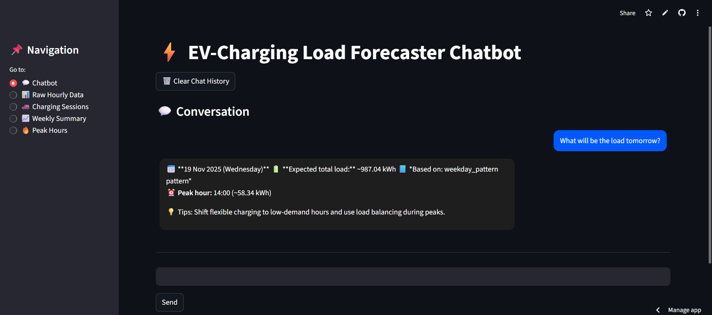
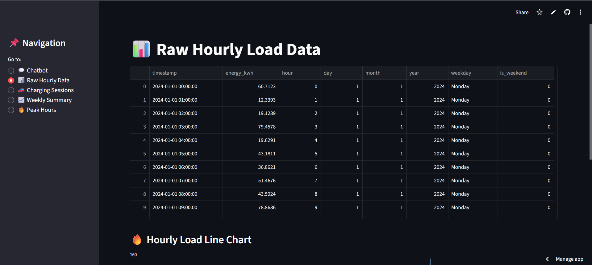
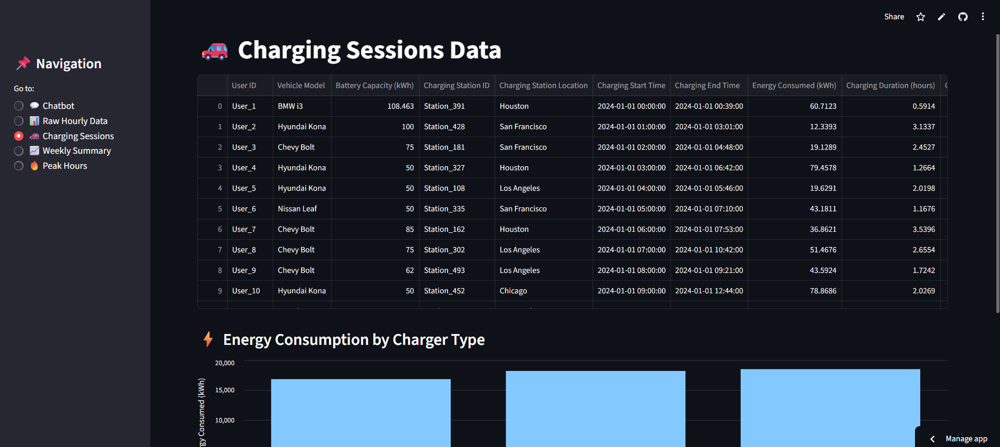
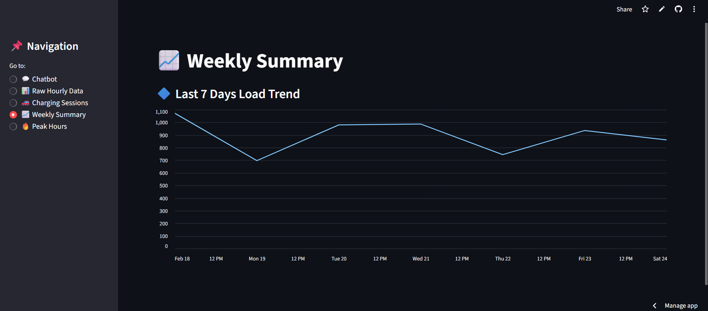
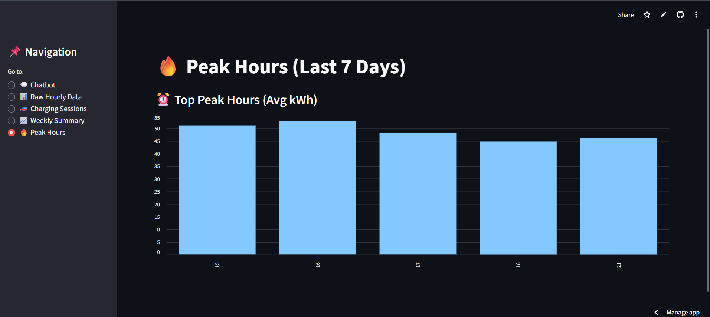

# ⚡ EV Charging Load Forecaster (with Gen-AI Chatbot + Dashboard)

An intelligent EV Charging Station Load Forecasting System powered by  
**Machine Learning**, **Time-Series Pattern Analysis**, and a **ChatGPT-style Gen-AI Chatbot**  
with a fully interactive **Streamlit Dashboard**.

<p>
  
  
  
  
  
</p>

---

## 📌 Table of Contents
- Overview
- Week 1 — Machine Learning Models
- Week 2 — Gen-AI Chatbot
- Week 3 — Streamlit Dashboard
- Screenshots
- Project Structure
- Installation
- Run the App
- Future Enhancements

---

# 🚀 Overview
This project predicts **daily and hourly EV charging load**, identifies **peak usage hours**, analyzes **charging session trends**, and provides an **AI-powered assistant** to help charging-station operators with natural-language queries.

---

# 🧠 Week 1 — Machine Learning Models

### ✔ Data Preprocessing & Feature Engineering  
Prepared datasets:
- `train_prepared.csv`
- `test_prepared.csv`

### ✔ Models Implemented  
- **Prophet** (Time-series model)  
- **XGBoost Regressor** (Machine learning model)

### ✔ Model Comparison  
| Model      | MAE    | RMSE   |
|------------|--------|--------|
| Prophet    | 18.52  | 24.87  |
| XGBoost    | 12.43  | 16.71  |

---

# 🤖 Week 2 — Gen-AI Chatbot

### ✔ Natural Language Understanding  
Handles:
- “Load tomorrow?”
- “Load on 15-11-2025?”
- “Show detailed forecast”
- “Next Monday?”
- “Who are you?”
- “How do you work?”

### ✔ Features  
- Predict load for any date  
- Show 24-hour detailed forecast  
- Peak hour detection  
- Weekly summary  
- Charger-type insights  
- Rejects unrelated/gibberish queries  
- Remembers last forecast date  

---

# 🎨 Week 3 — Streamlit Dashboard

### ✔ Chatbot Interface  
- ChatGPT-style bubble UI  
- Persistent chat history  
- Auto-clear input box  
- Detailed charts in responses  

### ✔ Data Visualizations  
- Hourly EV load trends  
- Charging session analytics  
- Weekly summary  
- Peak hours chart  

---

# 🖼️ Screenshots  
(Add real images into `/screenshots` folder and replace these.)

### Chatbot  


### Raw Hourly Data  


### Charging Sessions  


### Weekly Summary  


### Peak Hours  

---

# 📂 Project Structure
```
EV_Load_Forecaster/
│── app.py
│── chatbot.py
│── data_utils.py
│── hourly_ev_load.csv
│── ev_charging_patterns.csv
│── train_prepared.csv
│── test_prepared.csv
│── model_comparison_results.csv
│── prophet_forecast.csv
│── xgb_predictions.csv
│── README.md
│── requirements.txt
└── screenshots/
```

---

# ⚙️ Installation
```bash
pip install -r requirements.txt
```

---

# ▶️ Run the App
```bash
streamlit run app.py
```

Open:  
👉 http://localhost:8501

---

# 🚀 Future Enhancements  
- PDF report generator  
- EV demand simulation  
- Geo-based station map  
- Theme toggle  
- Cloud deployment  

---

# 🙌 Credits  
Developed across **3 Weeks**:  
- Week 1 → Machine Learning  
- Week 2 → Gen-AI Chatbot  
- Week 3 → Dashboard UI  

